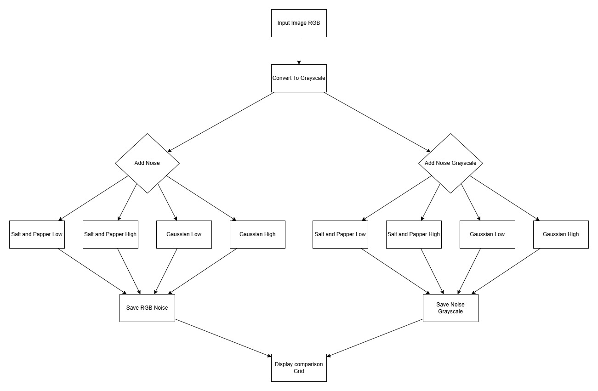
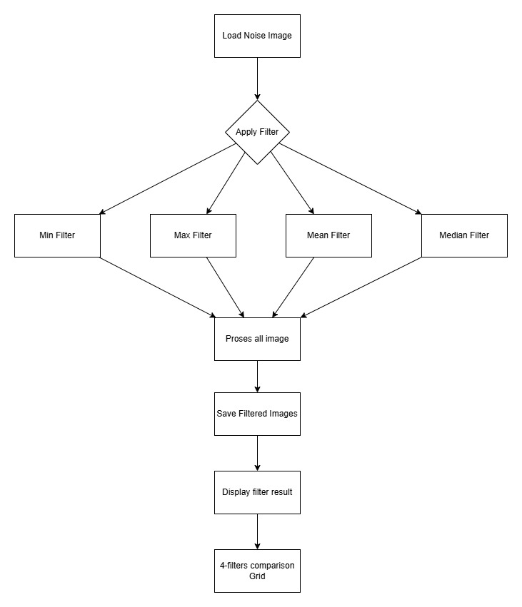

# Tahap 1: Gray.py-Generate Citra KDengan Berbagai Noise  

  

---

## Fungsi Utama  

* Konversi RGB ke Grayscale menggunakan weight method
* Penambahan Noise Salt dan Papper dengan probabilitas rendah (1%) dan tinggi (5%)
* Penambahan Noise Gaussian dengan standar deviasi rendah (15) dan tinggi (40)
* Menyimpan semua variasi citra ke folder **output/**
* Menampilkan Grid dengan perbandingan 2x5 untuk visualisasi  

## Output yang dihasilkan  

* portrait.jpg (original foto)
* portrait_gray.jpg (grayscale)
* portrait_spl_rgb.jpg, portrait_sph_rgb.jpg (salt & pepper RGB)
* portrait_gau_l_rgb.jpg, portrait_gau_h_rgb.jpg (gaussian RGB)
* portrait_spl_gray.jpg, portrait_sph_gray.jpg (salt & pepper grayscale)
* portrait_gau_l_gray.jpg, portrait_gau_h_gray.jpg (gaussian grayscale)  

---  

# Tahap 2: Filter.py-Aplikasi Filter untuk Noise Removal  

  

---

## Fungsi Utama  

* Min Filter: Mengambil nilai minimum dalam kernel
* Max Filter: Mengambil nilai maksimum dalam kernel
* Mean Filter: Rata-rata nilai dalam kernel
* Median Filter: Nilai median dalam kernel
* Mendukung RGB dan Grayscale
* Menyimpan hasil filtered ke folder **filtered/**
* Menampilkan grid perbandingan 4 filter untuk setiap citra  

## Filter yang diaplikasikan  

* min: Efektif untuk noise pepper tapi gelapkan citra
* max: Efektif untuk noise salt tapi terangkan citra
* mean: Smoothing umum, reduksi noise gaussian
* median: Terbaik untuk salt & pepper noise  

---  

