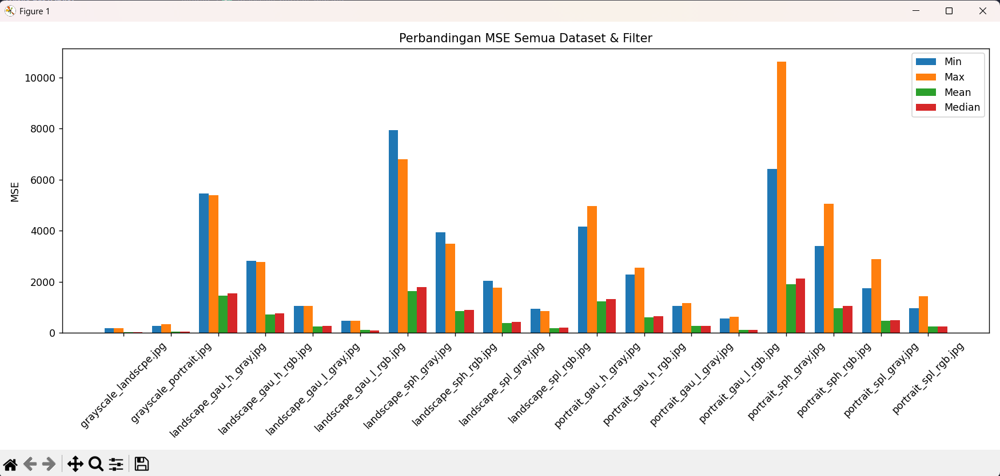
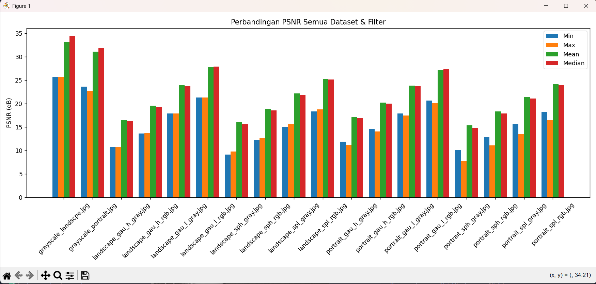

# Tahap 1: Gray.py-Generate Citra KDengan Berbagai Noise  

  

---

## Fungsi Utama  

* Konversi RGB ke Grayscale menggunakan weight method
* Penambahan Noise Salt dan Papper dengan probabilitas rendah (1%) dan tinggi (5%)
* Penambahan Noise Gaussian dengan standar deviasi rendah (15) dan tinggi (40)
* Menyimpan semua variasi citra ke folder **output/**
* Menampilkan Grid dengan perbandingan 2x5 untuk visualisasi  

## Output yang dihasilkan  

* portrait.jpg (original foto)
* portrait_gray.jpg (grayscale)
* portrait_spl_rgb.jpg, portrait_sph_rgb.jpg (salt & pepper RGB)
* portrait_gau_l_rgb.jpg, portrait_gau_h_rgb.jpg (gaussian RGB)
* portrait_spl_gray.jpg, portrait_sph_gray.jpg (salt & pepper grayscale)
* portrait_gau_l_gray.jpg, portrait_gau_h_gray.jpg (gaussian grayscale)  

---  

# Tahap 2: Filter.py-Aplikasi Filter untuk Noise Removal  

  

---

## Fungsi Utama  

* Min Filter: Mengambil nilai minimum dalam kernel
* Max Filter: Mengambil nilai maksimum dalam kernel
* Mean Filter: Rata-rata nilai dalam kernel
* Median Filter: Nilai median dalam kernel
* Mendukung RGB dan Grayscale
* Menyimpan hasil filtered ke folder **filtered/**
* Menampilkan grid perbandingan 4 filter untuk setiap citra  

## Filter yang diaplikasikan  

* min: Efektif untuk noise pepper tapi gelapkan citra
* max: Efektif untuk noise salt tapi terangkan citra
* mean: Smoothing umum, reduksi noise gaussian
* median: Terbaik untuk salt & pepper noise  

## Evaluasi Hasil  

### Nilai MSE  
  

**Penjelasan**  
Berdasarkan grafik perbandingan MSE, terlihat bahwa Min filtering dan Max filtering secara konsisten menghasilkan nilai MSE paling tinggi pada hampit setiap dataset. Sedangkan Mean filtering dan Median filtering menghasilkan nilai MSE yang jauh lebih rendah pada sebagian besar dataset. Median filtering menunjukkan nilai MSE yang paling kecil dan stabil, Mean filtering juga menghasilkan MSE rendah, meskipun pada beberapa citra nilainya sedikit lebih tinggi dibandingkan median.   

---  

  

**Penjelasan**  
Berdasarkan grafik PSNR Min filtering dan Max filtering memiliki nilai PSNR paling rendah pada hampir seluruh dataset. Sedangkan Median filtering secara konsisten menghasilkan nilai PSNR tertinggi pada berbagai jenis citra. Mean filtering berada pada posisi kedua dengan nilai PSNR yang relatif tinggi, meskipun sedikit lebih rendah dibandingkan median filtering, terutama pada citra dengan noise impulsif. Secara keseluruhan, hasil PSNR menegaskan bahwa Median filtering merupakan metode paling optimal, diikuti oleh Mean filtering.  

---  

## Catatan  
Projek ini dibuat untuk tujuan pembelajaran. 

